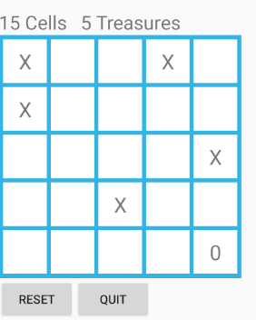

<h3>Technologies & skills</h3>

<ul>
  <li>Java</li>
  <li>Android Studio</li>
  <li>Gradle</li>
  <li>Multi-threaded programming</li>
</ul> 

<h3>Introduction</h3>

The goal of this project was to practice multi-threaded programming. I created a 5 X 5 grid and randomly generated 4 x's in the grid. 
A user can tap on a square and the main piece (0) will move and collect all the x's in its path. The program will keep track of the 
squares travelled and the number of X's collected.

<h3>What it looks like</h3>

This is what the board looks like when you first run this code


after moving 15 spaces and collecting 5 x's, the board will look like this



<h3>How to Run</h3> 

Make sure you have Android Studio installed and some type of emulator to test to program. 

```
git clone https://github.com/PaulCardoos/MazeGame-Android.git
```
When you open the project in Android Studio it should automatically build. 

Next, just click the play button on your app and your emulator should load and run the app. For reference look at the image below


That should be it, any questions feel free to contact me at paul.cardoos@outlook.com

<h3>Extras</h3>
Obviously, style is not the goal on this project

**(side note)** I am using a Pixel 4 x86 11GB Disk API 30 on Android 11.0 (google play). 


  
  
